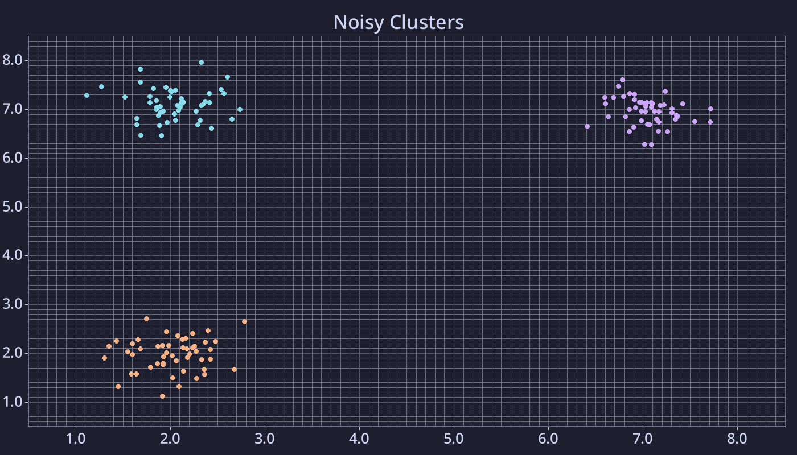

# 🧪 Clustering in Rust with Polars, Linfa, & Plotters

This project demonstrates a simple unsupervised learning pipeline in Rust:

- ✨ Randomly generated clustered data with Gaussian noise
- 📊 Clustering using [`linfa`](https://crates.io/crates/linfa)
- 🧮 Data manipulation and export with [`polars`](https://crates.io/crates/polars)
- 🎨 Pretty plotting with [`plotters`](https://crates.io/crates/plotters), using Catppuccin Mocha inspired colour scheme

---

## 📸 Output Example



---

## 🧰 Dependencies

Fontconfig is required by `plotters` for text rendering.  


On **Fedora Linux**:

```
sudo dnf install fontconfig-devel
```

## 🚀 Running
Simply run:
```
cargo run
```
and the program will:
- Generate data with noise
- Cluster it
- Produce a `.csv` with the data and clusters (including data prior to adding noise for inspection)
- Produce a plot in `.png` format


Example output files included in this repo.